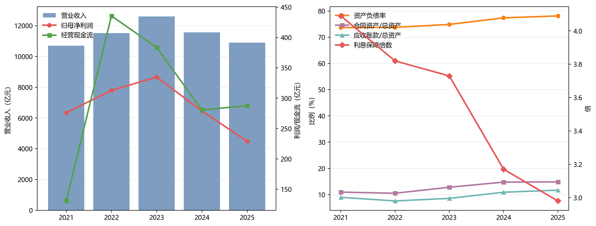
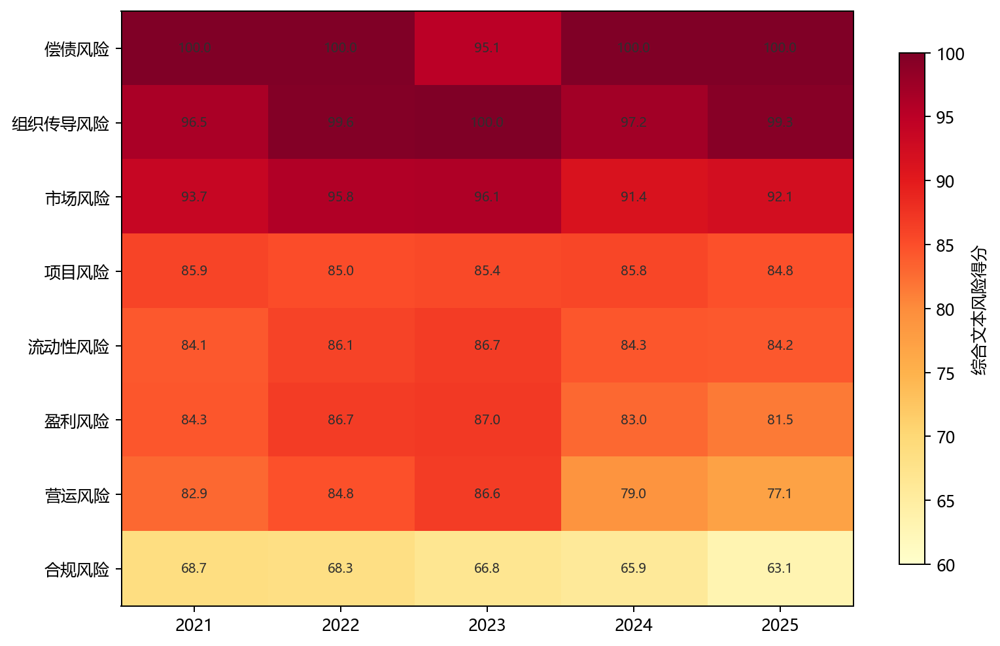
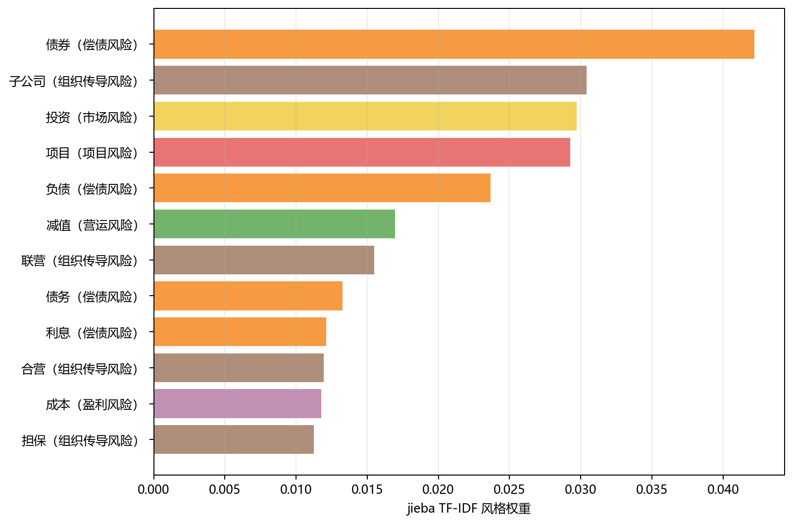
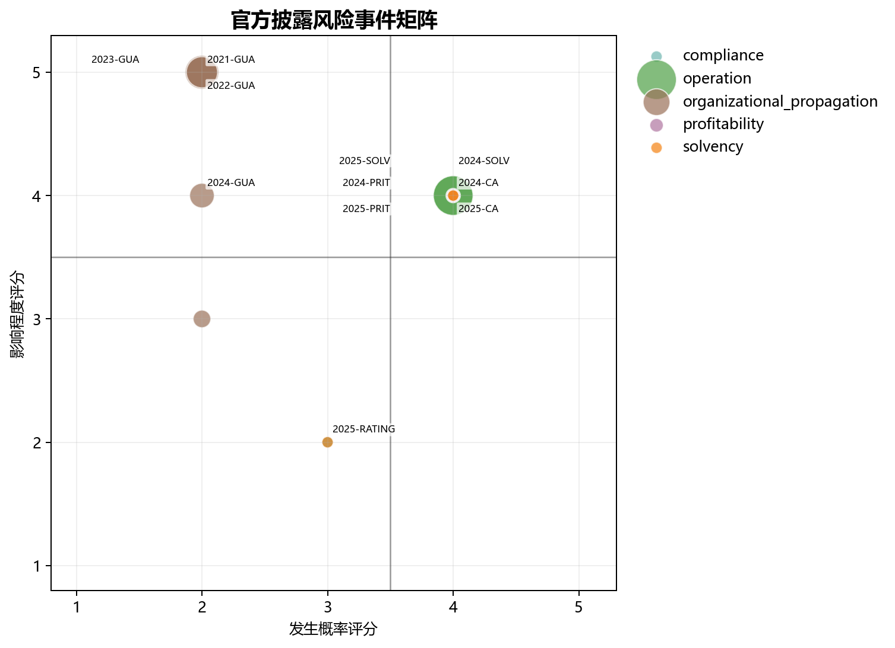
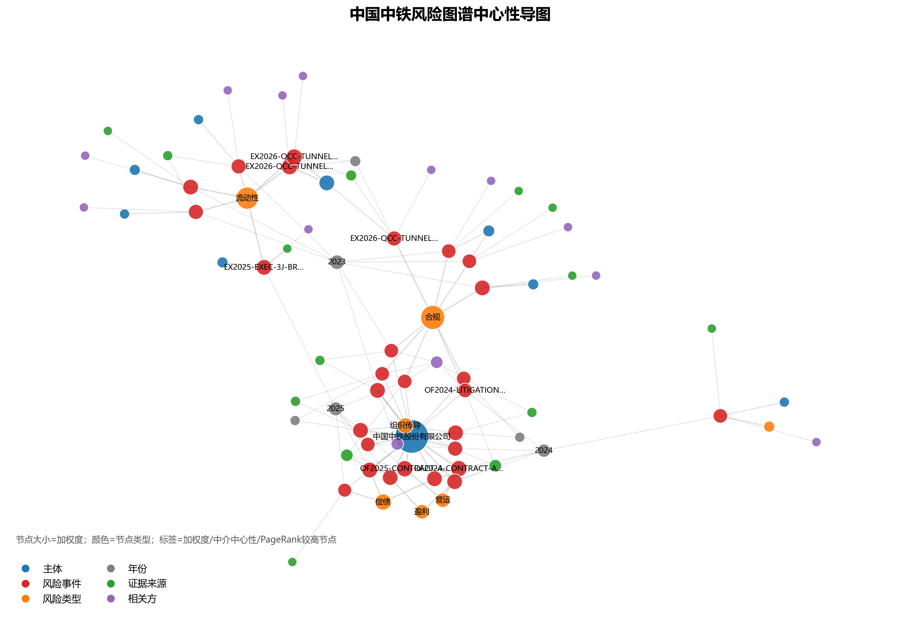
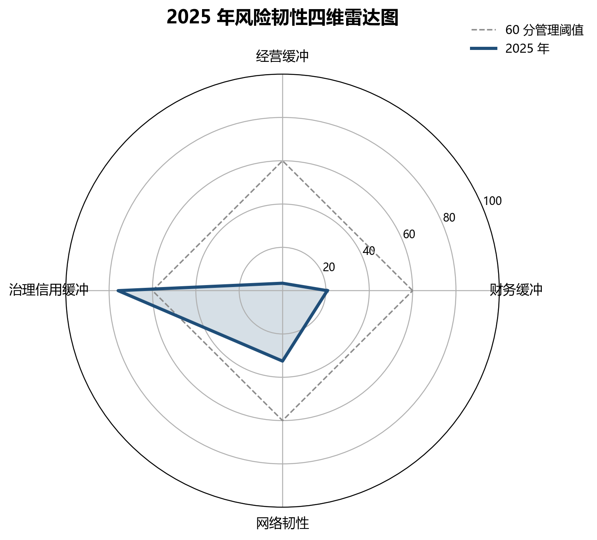
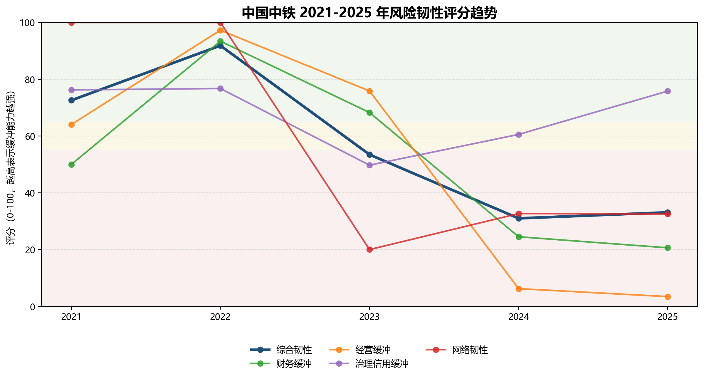

# 图表目录

生成脚本：`scripts/build_report_figures.py`、`scripts/analyze_risk_network.py`、`scripts/build_resilience_model.py`

## 可用于报告的图表

| 图表 | 文件 | 报告用途 |
|---|---|---|
| 财务风险趋势 | `docs/assets/figures/financial_trends.png` | 支撑财务指标趋势、盈利下行、资产负债率和利息保障倍数分析 |
| 文本风险热力图 | `docs/assets/figures/text_risk_heatmap.png` | 支撑文本风险指标和风险类别排序 |
| 2025 高权重风险词 | `docs/assets/figures/top_2025_risk_terms.png` | 支撑文本风险词典和年报风险语境解释 |
| 官方事件风险矩阵 | `docs/assets/figures/risk_event_matrix.png` | 支撑风险发生概率与影响程度二维评估 |
| 风险图谱中心性导图 | `docs/assets/figures/risk_network_gephi_style.png` | 支撑 Gephi 风险图谱、中心性和风险传导路径解释 |
| 2025 年风险韧性四维雷达图 | `docs/assets/figures/resilience_radar_2025.png` | 支撑弹性风险管理模型和风险缓冲能力解释 |
| 风险韧性评分趋势 | `docs/assets/figures/resilience_score_trend.png` | 支撑 2021-2025 年缓冲能力趋势分析 |

## 预览

## 解释边界

- 图表基于公开年报、评级报告和本地脚本整理结果生成。
- 风险矩阵使用官方披露种子事件；风险图谱导图使用官方披露、司法、执行和企查查扩展样本的合并事件表。
- 弹性风险管理图表是样本期内相对评分，不构成信用评级或投资建议。
- `outputs/figures/` 保存本地作图副本；`docs/assets/figures/` 用于 GitHub Pages 展示。
